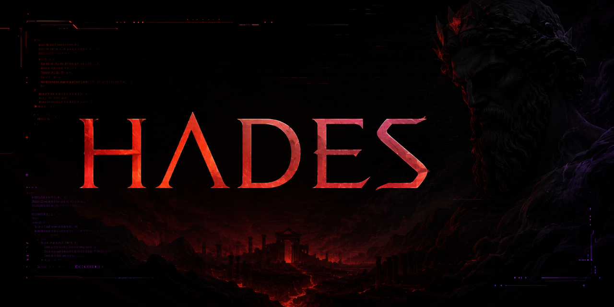
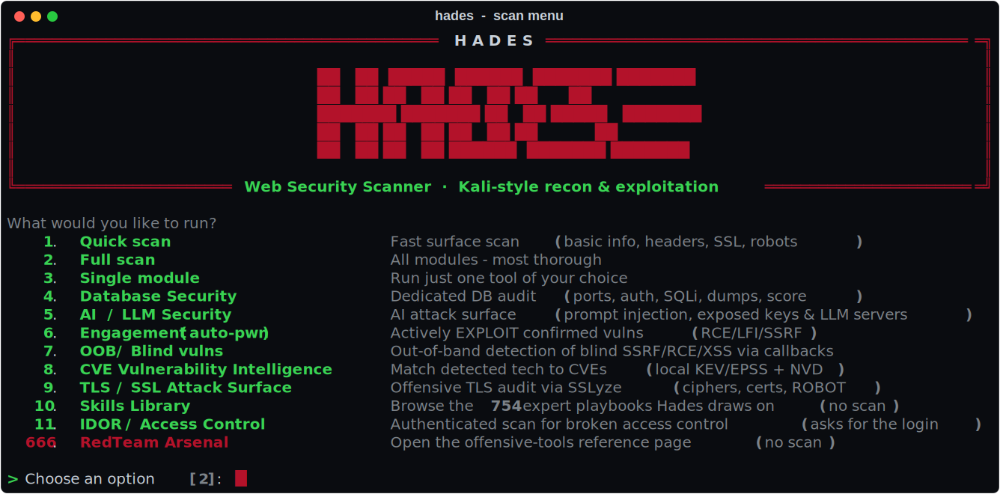
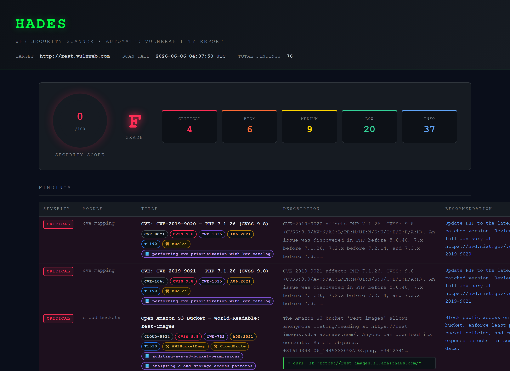

<p align="center">
  
</p>

<h3 align="center">Find the vulnerability. Prove it. Map the path to impact. Find the tool for the job.</h3>

<p align="center">
  
  
  
  
  
</p>

<p align="center">
  <a href="#quick-start"></a>
  &nbsp;
  <a href="https://github.com/YannChich/hades-web-scanner/issues/new"></a>
</p>

---

**Hades is a terminal-based, red-team web security scanner that does not just *find* weaknesses — it *proves* them.**

It runs 43 checks across reconnaissance, misconfiguration and vulnerability detection, confirms each
finding with an evaluated payload / timing / content signature (no blind guessing), maps it to
**CWE / OWASP / MITRE ATT&CK** with a CVSS score, links a step-by-step **expert playbook**, and weaves
everything into a single copy-paste **kill-chain attack path** — then exports a polished, self-contained
HTML report. On top of the standard scan, dedicated red-team profiles audit **databases**, the
**AI/LLM** attack surface, run an **active exploitation engagement**, catch **blind, out-of-band**
vulnerabilities other scanners miss, and rank a target's **CVEs** by real-world exploitability
(**KEV + EPSS**). It also ships a searchable **RedTeam Arsenal** — a curated list of **175 offensive
tools** grouped by attack type, each linked to its project — so you can jump straight from a finding
to the right tool for the job. One command.

```text
python hades.py --url https://target.tld
```

> [!IMPORTANT]
> Hades is for **authorised security testing only**. See the [Disclaimer](#disclaimer).

---

## Quick Start

```bash
git clone https://github.com/YannChich/hades-web-scanner.git
cd hades-web-scanner
pip install -r requirements.txt
python hades.py --url https://example.com
```

**What you get, immediately:**
- a clean, colour-coded terminal report — **severity + confidence**, technical evidence and remediation per finding;
- a styled **HTML report** that opens in your browser automatically;
- a machine-readable **JSON report** for tooling and records;
- an overall **security score (0–100) and A–F grade**, plus a kill-chain attack path.

**Where your reports are saved** (printed at the end of every scan):
- `reports/webscan_report_<timestamp>.html` — the full visual report (auto-opened)
- `reports/webscan_report_<timestamp>.json` — the same findings as structured JSON
- `logs/webscan_<timestamp>.log` — the detailed run log

**Why it matters:** Hades doesn't hand you a list of *maybe* — every finding carries a severity, a
confidence level, the evidence behind it, and a fix, so you know what's real and what to do next.

> Run `python hades.py` with no `--url` for an interactive menu (quick scan, full scan, the red-team
> profiles, CVE intelligence, TLS audit…). The install is clean on Linux, macOS and Windows; the
> optional extras (`playwright`, `sslyze`) are skipped gracefully if you don't install them.

Prefer to point and shoot? Launch `python hades.py` and pick a scan — options **1 to 9**, or **666**
for the RedTeam Arsenal:

<p align="center">
  
</p>

---

## Table of Contents

- [Quick Start](#quick-start)
- [Why Hades](#why-hades)
- [Features](#features)
- [Reports Preview](#reports-preview)
- [Understanding the Report Badges](#understanding-the-report-badges)
- [Installation](#installation)
- [Usage](#usage)
- [Scan Profiles](#scan-profiles)
- [Modules](#modules)
- [Example Output](#example-output)
- [Cross-Referenced Integrations](#cross-referenced-integrations)
- [Roadmap](#roadmap)
- [Tech Stack](#tech-stack)
- [Project Structure](#project-structure)
- [Contributing](#contributing)
- [Disclaimer](#disclaimer)
- [License](#license)

---

## Why Hades

Most scanners hand you a list of *maybe*. Hades is built around a different promise: **every finding is
evidence**, and every piece of evidence comes with the next move.

- **Proof, not noise.** Injection modules confirm the bug (evaluated math for SSTI, scaling time delays
  for blind injection, command output for RCE, file content for LFI) before reporting it.
- **Context for every finding.** CWE, OWASP category, MITRE ATT&CK technique, a representative CVSS
  score, a stable finding ID, a reproducible PoC command, the matching expert playbook, and the relevant
  offensive tools — attached automatically.
- **A path, not a pile.** All actionable findings are ordered into one kill-chain attack path
  (Reconnaissance to Impact), with copy-paste commands at each step.
- **Client-ready output.** A dark, self-contained HTML report is generated for *every* scan and opens in
  your browser automatically.

---

## Features

**Detection engine**
- 43 modules across reconnaissance, web/misconfiguration analysis and active vulnerability detection.
- Shared, rate-limited crawler feeds every module the same parameters, forms, links and emails.
- Anti-noise baselines (catch-all 200, blanket 403/5xx, accept-all ports, soft-404) keep results accurate.

**Offensive injection arsenal (active verification)**
- SQLi, XSS, command injection, SSTI, LFI/path traversal, open redirect and SSRF — each *proven*, with a
  clickable proof link and a ready exploitation command.
- JWT attacks (`alg:none`, weak-secret cracking, claim disclosure), 401/403 access-control bypass, CVE
  mapping via the NVD, and a default-credentials advisory.

**Dedicated red-team profiles**
- `db_scan` — database exposure audit: port/banner fingerprint, unauthenticated access with live data
  extraction, SQL/NoSQL injection, secret-file and connection-string hunting, exposed admin GUIs, a DB
  Exposure Score and an exploitation Attack Path.
- `ai_scan` — offensive AI/LLM attack surface mapped to the OWASP LLM Top 10 (2025) and MITRE ATLAS:
  SDK/framework fingerprinting, exposed AI keys (20+ providers), unauthenticated local LLM servers
  (Ollama, vLLM, LM Studio, Open WebUI, Triton…), exposed AI UIs and agent/plugin manifests, and the
  prompt-injection surface. With `--exploit` it proves impact with benign payloads — confirmed prompt
  injection, **system-prompt leakage**, **jailbreak**, LLM-driven XSS and free inference — with an AI
  Exposure Score, an ATLAS attack path and evidence in `loot/`.
- `engage` — exploitation-first engagement that actively proves impact with benign payloads (RCE proof
  via `id`, arbitrary file read, SSRF to cloud metadata) and writes evidence files.
- `oob_scan` — out-of-band (OAST) detection of blind SSRF / RCE / stored XSS via a self-hosted callback
  listener, with an automatic public tunnel (cloudflared / ngrok) so it works behind NAT.
- `cve_scan` (interactive **menu option 8**) — CVE Vulnerability Intelligence: fingerprints the target's
  stack broadly (HTTP headers, JS/CSS/CMS/framework signatures, and SSH/FTP/mail/DB service banners),
  matches it to real CVEs from a local vulnerability database, and ranks each by a Hades CVE
  Priority Score that fuses CVSS, FIRST EPSS exploit probability and the CISA KEV catalog. 100% free,
  no API key — built from CISA KEV, FIRST EPSS and the NVD 2.0 API; the local SQLite database is
  auto-created and auto-refreshed. Run `python tools/build_vulndb.py` once to bulk-load the **entire
  NVD corpus** (~270k CVEs) for fully **offline** matching — incrementally refreshed thereafter.
  Reports only CVEs from **2020 onward** (older ones are filtered out as noise).
- `tls_scan` (interactive **menu option 9**) — offensive TLS/SSL attack-surface audit via the **SSLyze**
  handshake engine: legacy protocols (SSLv2/3, TLS 1.0/1.1), weak/anonymous/NULL ciphers, missing
  forward secrecy, certificate trust/expiry/hostname/weak-signature issues, TLS compression (CRIME),
  insecure renegotiation, and confirmable TLS vulns (**Heartbleed, ROBOT, OpenSSL CCS injection**) —
  each rated by what it enables on the wire (downgrade, sniffing, AitM) and mapped to CWE / OWASP /
  ATT&CK. Handshake-only and read-only; `sslyze` is an optional dependency.

**Intelligence and reporting layer**
- Framework mapping (CWE / OWASP / ATT&CK / CVSS), expert playbooks, per-finding RedTeam tools, and a
  unified kill-chain attack path — surfaced in the console, JSON and HTML.
- Backed by the **754-skill Anthropic-Cybersecurity-Skills library**: findings are matched to playbooks
  by ATT&CK technique + tags (not just a hardcoded list), and each finding pairs an **offensive**
  playbook (how to exploit it) with a curated **blue-team remediation** playbook (how to detect/fix it).
- Browse the whole library as a searchable **Skills Library** page (`--skills` / menu **777**) — all
  754 playbooks grouped by subdomain, with offensive/defensive markers and ATT&CK chips.
- Every reference badge in the HTML report is **clickable** — CVE → NVD, CVSS → the FIRST calculator,
  CWE → cwe.mitre.org, OWASP → owasp.org, ATT&CK → attack.mitre.org, tool → GitHub — just like the playbooks.
- Weighted 0-100 risk score with an A-F grade (informational findings never affect the grade).
- Every finding carries a **confidence** level (high/medium/low) shown in the terminal and the reports.
- Every scan writes an **HTML report** (auto-opened) **and a JSON report**, plus a timestamped log.

> A plain-language guide to every module — what it checks, the consequence of a finding, and the attack
> it enables — is generated as a PDF: [`docs/Hades_Modules_Guide.pdf`](docs/Hades_Modules_Guide.pdf).

---

## Reports Preview

Every scan produces a dark, self-contained HTML report (clickable framework badges, a security-score
gauge, the kill-chain attack path, matched playbooks, and the DB/AI panels).

<p align="center">
  
</p>

<!--
  SCREENSHOTS — drop your images here and they will render above/below automatically:
    assets/screenshots/hades-report.png    HTML report (e.g. a scan of http://rest.vulnweb.com)
    assets/screenshots/hades-console.png   terminal output (findings table + attack path)
  Suggested demo target (authorised test site): http://rest.vulnweb.com
    python hades.py --url http://rest.vulnweb.com --profile full
-->

> Terminal capture coming soon. To generate your own demo, scan an authorised test target such as
> `http://rest.vulnweb.com` and the HTML report opens automatically.

---

## Understanding the Report Badges

Every finding in the HTML report is tagged with a row of small **badges** that turn a raw result into
context you can act on. **Every badge is a clickable link** to its authoritative reference page (opens
in a new tab) — so one click takes you from a finding to the definition of the weakness, the scoring
calculator, or the attacker technique. Here is how to read each one.

**Score & grade (top of the report)**

| Indicator | Looks like | Meaning |
|-----------|------------|---------|
| Security score | a `0–100` gauge | Weighted risk score — **higher is safer**. Only actionable findings count; INFO items never lower it. |
| Grade | `A` … `F` | Letter grade derived from the score (A green &rarr; F red). |

**Severity badge** — one per finding, on the left

| Badge | Meaning | Lowers the score? |
|-------|---------|-------------------|
| `CRITICAL` | Directly exploitable now — confirmed injection, exposed secret/`.env`, world-readable bucket. | Yes |
| `HIGH` | Serious; a likely path to compromise — LFI, reflected XSS, exposed admin panel or `.git`. | Yes |
| `MEDIUM` | Worth fixing; helps an attacker or leaks info — missing CSP/HSTS, in-band SSRF, open redirect. | Yes |
| `LOW` | Minor hardening gap, little direct risk on its own. | Yes (slightly) |
| `INFO` | Context only — load time, detected technology, "none found". | **No** |

**Reference badges** — the coloured pills under each finding title (each one is a link)

| Badge | Looks like | What it tells you | Click opens |
|-------|------------|-------------------|-------------|
| ID / CVE | `SQLI-3F9A` or `CVE-2021-23017` | A stable Hades ID for the finding (`MODULE-XXXX`) — or, for CVE findings, the **real CVE number**. | The NVD page for the CVE |
| CVSS | `CVSS 9.8` | Industry severity score 0–10 (&ge;9 critical, &ge;7 high, &ge;4 medium). Coloured to match the finding. | The FIRST CVSS calculator (pre-filled with the vector when known) |
| CWE | `CWE-79` | The **class** of weakness (CWE-79 = Cross-Site Scripting). The root-cause category. | cwe.mitre.org definition |
| OWASP | `A03:2021` | The **OWASP Top 10 (2021)** category the issue falls under. | owasp.org Top 10 page |
| ATT&CK | `T1190` | The **MITRE ATT&CK** technique an attacker uses to exploit it — the finding mapped to real adversary behaviour. | attack.mitre.org technique |
| Tool | `sqlmap` | The offensive **tool** best suited to verify or exploit this finding. | The tool's GitHub repository |
| Playbook | `<name>` | A step-by-step **offensive expert playbook** (detection &rarr; exploitation) matched to the finding. | The full playbook, **rendered as a readable HTML page** (dark theme, code/tables) — not raw Markdown |
| Fix | `Fix: <name>` | A curated **blue-team remediation** playbook — how to **detect and fix** the issue (the defensive complement to the offensive playbook). | The remediation write-up (rendered HTML page, or GitHub) |

> **How to read a finding at a glance:** the **severity** badge says *how urgent*; **CWE / OWASP** say
> *what kind of bug*; **CVSS** says *how severe in the abstract*; **ATT&CK** says *how it's abused*; and
> the **tool + playbook** badges say *what to do next*. Click any badge to open its reference.

---

## Installation

**Requirements:** Python 3.10+

```bash
git clone https://github.com/YannChich/hades-web-scanner.git
cd hades-web-scanner

pip install -r requirements.txt

python hades.py --url https://example.com      # that's it — HTML + JSON reports are generated

# Optional extras (Hades runs fine without them):
playwright install chromium    # enables homepage screenshots in the report
pip install sqlmap             # enables the --exploit sqlmap launcher
```

**Docker**

```bash
docker compose -f docker/docker-compose.yml build
docker compose -f docker/docker-compose.yml run --rm webscan --url https://example.com
```

**Recommended — full local experience (optional)**

Hades cross-references two external knowledge bases. Clone them *next to* the project so every playbook
link and the RedTeam-Tools PDF resolve locally. Without them Hades still runs and falls back to GitHub
links — nothing breaks.

```bash
# run in the PARENT folder, alongside hades-web-scanner/
git clone https://github.com/mukul975/Anthropic-Cybersecurity-Skills   # expert playbooks
git clone https://github.com/A-poc/RedTeam-Tools                        # red-team tool catalogue
```

---

## Usage

**Interactive (menu-driven, minimal flags)** — run with just a URL and Hades walks you through the
scan type and exploitation choices:

```bash
python hades.py --url http://testphp.vulnweb.com/
# or fully interactive (also prompts for the URL):
python hades.py
```

Every scan always generates the HTML report and auto-opens it (`--no-open` to disable).

**Command line**

```bash
# Full scan (default profile)
python hades.py --url https://example.com --profile full

# Quick passive surface scan
python hades.py --url https://example.com --profile quick

# Database security audit (red-team)
python hades.py --url https://example.com --profile db_scan

# AI / LLM attack-surface audit
python hades.py --url https://example.com --profile ai_scan

# Active exploitation engagement (asks for authorisation)
python hades.py --url https://example.com --profile engage

# Out-of-band / blind vulnerabilities (auto-tunnels via cloudflared behind NAT)
python hades.py --url https://example.com --profile oob_scan

# CVE Vulnerability Intelligence — run the interactive menu and pick option 8
python hades.py --url https://example.com          # then choose [8] CVE Vulnerability Intelligence

# Offensive TLS/SSL audit (SSLyze) — protocols, ciphers, certs, Heartbleed/ROBOT/CCS
python hades.py --url https://example.com --profile tls_scan

# RedTeam Arsenal — a searchable reference page of 175 offensive tools by attack type
python hades.py --arsenal          # opens an HTML catalogue (no scan; also menu option 666)

# Skills Library — a searchable page of the 754 expert playbooks Hades draws on, by subdomain
python hades.py --skills           # opens an HTML catalogue (no scan; also menu option 777)

# (one-time) bulk-load the full NVD corpus for offline CVE matching — optional NVD_API_KEY speeds it up
python tools/build_vulndb.py                       # then cve_scan matches ~270k CVEs locally, offline

# Every scan writes both an HTML report (auto-opened) and a JSON report — no flag needed.

# Through a proxy, with a session cookie
python hades.py --url https://example.com --proxy http://127.0.0.1:8080 --cookies "session=abc123"
```

<details>
<summary><b>All command-line options</b></summary>

| Flag | Short | Default | Description |
|------|-------|---------|-------------|
| `--url` | `-u` | — | Target URL (required, or prompted interactively) |
| `--profile` | `-p` | `full` | `quick` `passive` `cms` `full` `db_scan` `ai_scan` `engage` `oob_scan` `tls_scan` (`cve_scan` is menu option 8) |
| `--no-open` | | `false` | Do not auto-open the HTML report in a browser (both HTML + JSON are always written) |
| `--arsenal` | | `false` | Open the **RedTeam Arsenal** — a searchable HTML catalogue of 175 offensive tools by attack type, each with its project/GitHub link (no scan; also menu option **666**) |
| `--skills` | | `false` | Open the **Skills Library** — a searchable HTML catalogue of the 754 expert playbooks Hades draws on, grouped by subdomain, each linking to its full write-up (no scan; also menu option **777**) |
| `--exploit` | | `false` | Launch sqlmap on confirmed SQL injections (authorised targets only) |
| `--bruteforce` | | `false` | Spray common credentials at login forms and Basic-Auth (authorised only) |
| `--oob-host` | | auto | Reachable callback address for `oob_scan` (public IP / tunnel) |
| `--oob-port` | | `0` | OAST callback listener port (`0` = auto-pick) |
| `--proxy` | | — | HTTP/HTTPS proxy URL |
| `--threads` | `-t` | `10` | Concurrent thread count |
| `--ignore-robots` | | `false` | Ignore robots.txt restrictions |
| `--wordlist` | `-w` | built-in | Custom wordlist path |
| `--cookies` | | — | Cookie header string |
| `--auth-token` | | — | Bearer token for the Authorization header |

</details>

---

## Scan Profiles

| Profile | Type | Description |
|---------|------|-------------|
| `quick` | Fast | Passive surface scan (basic info, headers, SSL, robots) |
| `passive` | Moderate | All recon and passive web modules, no active probing |
| `cms` | Targeted | CMS detection, admin panels, CVE mapping |
| `full` | Thorough | Everything, including the injection arsenal (default) |
| `db_scan` | Red team | Database security audit |
| `ai_scan` | Red team | AI/LLM attack surface (OWASP LLM Top 10 + ATLAS) |
| `engage` | Offensive | Active engagement — auto-exploit confirmed RCE/LFI/SSRF |
| `oob_scan` | Offensive | Out-of-band detection of blind SSRF/RCE/XSS |
| `cve_scan` | Intelligence | CVE Vulnerability Intelligence (menu option 8) — CVE matching + KEV/EPSS prioritisation |
| `tls_scan` | Red team | Offensive TLS/SSL audit (menu option 9) — SSLyze protocols/ciphers/certs + Heartbleed/ROBOT/CCS |

---

## Modules

Each finding is enriched with CWE / OWASP / MITRE ATT&CK / CVSS, a PoC, a matched playbook and the
relevant RedTeam tools. Full plain-language explanations live in
[`docs/Hades_Modules_Guide.pdf`](docs/Hades_Modules_Guide.pdf).

<details open>
<summary><b>Reconnaissance (11)</b></summary>

`basic_info` &middot; `whois_lookup` &middot; `dns_check` (SPF/DKIM/DMARC) &middot; `ssl_check` &middot;
`port_scan` &middot; `waf_detect` &middot; `tech_stack` &middot; `js_recon` (leaked secrets + hidden
endpoints) &middot; `cloud_buckets` (S3/GCS/Azure) &middot; `git_dumper` (exposed `.git`) &middot;
`wayback` (archive URL mining)

</details>

<details>
<summary><b>Website &amp; Misconfiguration (20)</b></summary>

`headers_check` &middot; `robots_txt` &middot; `sitemap` &middot; `cms_detect` &middot; `admin_panel`
&middot; `dir_scan` &middot; `subdomain_scan` (+ takeover) &middot; `broken_links` &middot;
`http_methods` &middot; `backup_files` &middot; `sensitive_files` &middot; `cookie_analysis` &middot;
`redirect_chain` &middot; `email_exposure` &middot; `favicon_hash` &middot; `cors_check` &middot;
`clickjacking` &middot; `dir_listing` &middot; `blacklist_check` &middot; `screenshot`

</details>

<details>
<summary><b>Vulnerability Detection (12)</b></summary>

`sqli_detect` &middot; `xss_detect` &middot; `command_injection` &middot; `ssti_detect` &middot;
`lfi_detect` &middot; `open_redirect` &middot; `ssrf_detect` &middot; `jwt_attacks` &middot;
`auth_bypass` &middot; `bruteforce` (opt-in) &middot; `cve_mapping` &middot; `default_creds`

</details>

<details>
<summary><b>Red-team profiles</b></summary>

- **`db_scan`** — DB port/banner fingerprint, unauthenticated access with live extraction, SQL/NoSQL
  injection, secret-file and connection-string hunting, exposed admin GUIs, DB Exposure Score + Attack Path.
- **`ai_scan`** — AI SDK fingerprinting, exposed AI keys, unauthenticated local LLM servers, exposed AI
  UIs, prompt-injection surface (OWASP LLM Top 10 + MITRE ATLAS).
- **`engage`** — active exploitation: RCE proof, arbitrary file read, SSRF to cloud metadata, with evidence files.
- **`oob_scan`** — out-of-band detection of blind SSRF / RCE / stored XSS via a self-hosted callback listener.
- **`cve_scan`** (menu option 8) — CVE Vulnerability Intelligence: stack fingerprint → CPE → CVE matching
  against a local KEV/EPSS/NVD database, ranked by the Hades CVE Priority Score (CVSS + EPSS + CISA KEV).
  `tools/build_vulndb.py` bulk-loads the full NVD corpus (~270k CVEs) for offline matching.
- **`tls_scan`** (menu option 9, `scanner/tls/hephaestus_tls.py`) — offensive TLS/SSL audit via SSLyze:
  legacy protocols, weak/anon/NULL ciphers, no forward secrecy, certificate trust/expiry/hostname/weak
  signature, TLS compression, insecure renegotiation, Heartbleed / ROBOT / CCS injection.

</details>

---

## Example Output

The unified kill-chain attack path, grouped by MITRE ATT&CK tactic with copy-paste commands:

```text
────────────────────────── Attack Path — Kill Chain ───────────────────────────
  4 actionable step(s) across 3 ATT&CK phase(s), in attacker order.

▼ Initial Access  TA0001
   1.  CRITICAL  SQL Injection (error): id            SQLI-D65F · T1190
                 $ sqlmap -u 'http://t/p?id=1' --batch --dbs
                 playbook: exploiting-sql-injection-vulnerabilities    tools: nuclei
▼ Credential Access  TA0006
   2.  CRITICAL  .env file exposed                    SENSIT-7EDB · T1552.001
                 $ curl -sk "http://t/.env"
   3.  HIGH      Exposed .git directory               GIT-0D07 · T1552.001
                 $ git-dumper http://t/.git/ ./loot_src
▼ Discovery  TA0007
   4.  LOW       Open port 6379 (Redis)               PORT-1F15
                 $ nmap -sV -p 6379 10.0.0.5
```

Reports are written to `reports/` (HTML and JSON, every scan) and logs to `logs/`.

---

## Cross-Referenced Integrations

Hades cross-references two open-source knowledge bases:
**[Anthropic-Cybersecurity-Skills](https://github.com/mukul975/Anthropic-Cybersecurity-Skills)**
(expert playbooks) and **[RedTeam-Tools](https://github.com/A-poc/RedTeam-Tools)** (tool catalogue + PDF).

Cloning them gives the full local experience; a plain clone degrades gracefully:

| Capability | Both repos cloned | Plain clone (fallback) |
|------------|-------------------|------------------------|
| Scan, profiles, framework mapping, attack path | yes | yes |
| RedTeam tool references (per finding) | yes | yes (names are built in) |
| Playbook references | full local skill text + `file://` links | bundled index, links to GitHub |
| RedTeam-Tools reference PDF | offline build | README fetched from GitHub |

All credit for those catalogues goes to their authors ([@mukul975](https://github.com/mukul975),
[@A-poc](https://github.com/A-poc)); Hades only references and links to them.

---

## Roadmap

Hades is under active development. Planned and in-progress work:

- [ ] Blind SQL injection over DNS (OAST DNS listener)
- [ ] Authenticated / session-aware crawling and BOLA / IDOR testing
- [ ] WAF-aware payload mutation (auto-bypass and re-confirm)
- [ ] Nuclei template bridge (ingest results into the framework/playbook layer)
- [ ] Expanded MITRE ATLAS coverage for the AI/LLM profile
- [x] CVE Vulnerability Intelligence with KEV + EPSS prioritisation (menu option 8)
- [x] Out-of-band (OAST) blind-vulnerability detection with auto-tunnel
- [x] Unified kill-chain attack path across all profiles
- [x] AI/LLM and database red-team profiles

---

## Tech Stack

`httpx` (HTTP) &middot; `Rich` (terminal UI) &middot; `dnspython` &middot; `python-whois` &middot;
`cryptography` (TLS) &middot; `BeautifulSoup4` / `lxml` &middot; `Markdown` &middot; `loguru` &middot;
`mmh3` &middot; optional: `Playwright` (screenshots) &middot; `SSLyze` (TLS audit) &middot;
`sqlmap` (`--exploit`). Reports: self-contained **HTML** + structured **JSON**.

---

## Project Structure

```text
hades-web-scanner/
├── hades.py                 # Entry point — `python hades.py --url …`
├── main.py                  # CLI, interactive menu, argument parsing (cli() lives here)
├── config.py                # Profiles, taxonomy, cross-reference maps, constants
├── scanner/
│   ├── engine.py            # Orchestration, threading, rate limiting, HTML auto-open
│   ├── crawler.py           # Shared site crawler
│   ├── severity.py          # Single source of truth for severity ordering/styles
│   ├── recon/  web/  vulns/ # The 43 scan modules
│   ├── db/   ai/   offensive/   oob/   # Red-team profiles (db_scan, ai_scan, engage, oob_scan)
│   ├── cve/                 # CVE Vulnerability Intelligence (cve_scan, menu option 8)
│   ├── tls/                 # Offensive TLS/SSL audit via SSLyze (tls_scan, menu option 9)
│   ├── intel/               # Skills-library enrichment (ATT&CK/tag matching, red+blue playbooks) + Skills Library page
│   └── output/              # Console, scoring, attack path, HTML + JSON reports
├── data/vulndb/            # CVE module: aliases.json (tracked) + local SQLite DB (git-ignored)
├── docs/                    # Reference PDFs + their generator scripts
├── tools/                   # Dev utilities (import check, playbook bundle builder)
├── tests/                   # pytest suite
└── docker/                  # Dockerfile + compose
```

---

## Contributing

Contributions are welcome.

1. Fork and create a feature branch: `git checkout -b feature/new-module`.
2. Add at least one test in `tests/test_modules.py`.
3. Open a pull request describing what the module detects.

New scan modules follow the `run(engine: ScanEngine) -> list[Finding]` signature and must handle their
own exceptions without crashing the engine. Active injection modules reuse `scanner/vulns/_common.py`
(crawler parameters/forms, safe-mode check, proof URLs).

---

## Disclaimer

Hades is intended for **authorised security testing only** — your own systems, or targets you have
**explicit written permission** to assess. Scanning or exploiting systems without authorisation is
illegal in most jurisdictions. Active exploitation is opt-in and gated behind a per-target confirmation;
the project ships detection-only by default. The author accepts no liability for misuse.

---

## License

Released under the [MIT License](LICENSE).

<p align="center"><sub>If Hades is useful to you, consider leaving a star — it helps the project grow.</sub></p>
